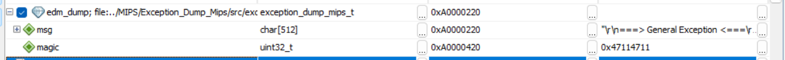
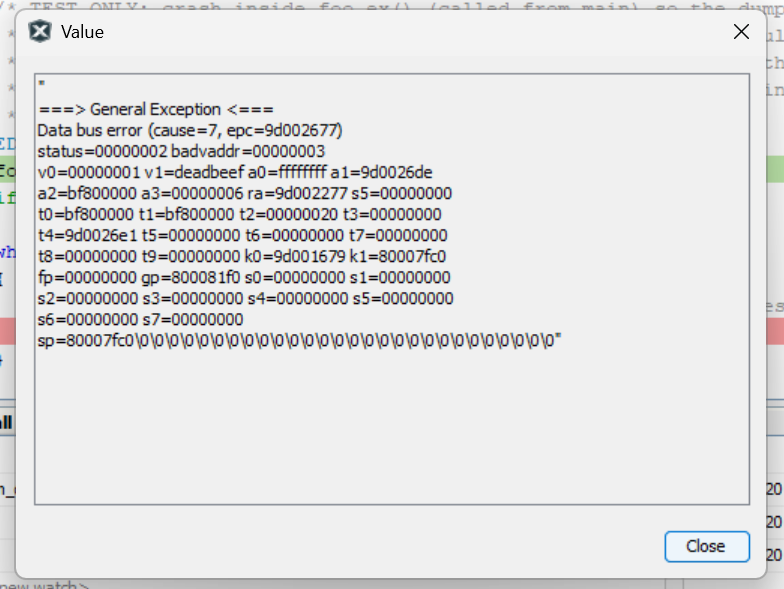

# PIC32 MIPS Exception Dump Package

## Introduction

This library captures the CPU state at the moment a MIPS/PIC32 firmware crashes
on an unhandled CPU exception and turns that raw register dump into a precise,
human-readable post-mortem — down to the exact source line that caused the fault.
This README demonstrates how it works end-to-end on an **example PIC32MM project
running in the MPLAB X Simulator**.

As part of the integration a small **Python analyzer** is produced for your
project: it reads the firmware's exception output (straight from the clipboard or
a file), regenerates the disassembly listing, decodes the exception, and finds
and shows the **source-code line that caused it** (function, file path, line).

You can add the library to your own project by hand simply by following this
README. But the included [`CLAUDE.md`](CLAUDE.md) makes that **much faster with
the help of [Claude Code](https://claude.com/claude-code)**: open your MPLAB X
project (or this library folder) in Claude Code and type something like
*"integrate the MIPS exception dump library into my project"* — or just *"read
CLAUDE.md"*. Claude then reads `CLAUDE.md` and runs a **guided, interview-driven
session**: it asks the few decisions that matter (capture mode, target device,
UART/console transport, any existing exception-handler conflicts) and then
performs the integration steps for you, including generating the project-specific
analyzer above.

## Table of Contents

- [Introduction](#introduction)
- [Purpose](#purpose)
- [What Is Captured](#what-is-captured)
- [Runtime Flow](#runtime-flow)
- [Capture Modes](#capture-modes)
- [Target Architecture (incl. PIC32MM)](#target-architecture-incl-pic32mm)
- [Integration Steps](#integration-steps)
- [Public API](#public-api)
- [Porting Layer](#porting-layer)
- [Persistent RAM / No-Init RAM](#persistent-ram--no-init-ram)
- [Exception Handler Integration](#exception-handler-integration)
- [Known Limitations](#known-limitations)
- [Test Procedure](#test-procedure)
- [Files](#files)

## Purpose

This package captures MIPS / PIC32 CPU exception information when an unhandled
CPU exception occurs (address error, bus error, reserved instruction, etc.) and
formats a human-readable register dump. It supports two capture modes (see
[Capture Modes](#capture-modes)):

- **Mode A — Debugger / breakpoint:** the handler captures the dump and halts;
  you read the dump string in a Watch window. No reset, no UART, no linker work.
- **Mode B — Persistent-RAM + UART:** the dump is stored in **persistent
  (no-init) RAM**, the device performs a controlled software reset, and the
  stored dump is printed over a **user-provided output function** (UART / debug
  console) on the next boot.

It is a small, plain-C library with a thin porting layer so it can be reused
across PIC32MX / PIC32MZ / PIC32MZW1 / WFI32 / PIC32MK / **PIC32MM** projects,
bare-metal or Harmony 3 / MCC / Melody.

> Working in Claude Code? See [`CLAUDE.md`](CLAUDE.md) — it guides an assisted,
> interview-driven integration into your own MPLAB X project.

## What Is Captured

- **CP0 `Cause` (ExcCode)** — decoded to a text reason (e.g. "Store address
  error", "Reserved instruction").
- **CP0 `EPC`** — the exception program counter (faulting instruction address).
- **General-purpose registers** recovered from the exception stack frame:
  `v0, v1, a0–a3, ra, t0–t9, k0, k1, fp, gp, s0–s7, sp` (and `LO`/`HI` are saved
  by the vector). Requires the assembly vector; disabled by default on
  PIC32MM / GENERIC (see [Target Architecture](#target-architecture-incl-pic32mm)).

Added when `EDM_CAPTURE_EXTRA_CP0` is on (default):

- **CP0 `Status`**
- **CP0 `BadVAddr`**

Not captured by default: `ErrorEPC`, `Config`, `PRId`, `Debug`, `DEPC`. They can
be added easily in `exception_dump_mips.c` if needed.

## Runtime Flow

```
   exception occurs
        │
        ▼
  assembly vector (exception_dump_mips_vector.S)
   saves all GPRs to a 140-byte stack frame, calls the C handler
        │
        ▼
  _general_exception_handler()  (exception_dump_mips.c)
   • read GPRs from the saved frame
   • read CP0 Cause / EPC (+ Status / BadVAddr)
   • sprintf full dump into persistent buffer  edm_dump.msg
   • set edm_dump.magic = EDM_MAGIC_CODE
   • software reset (edm_port_default_reset or your callback)
        │
        ▼  ── device reboots, .persist RAM retained ──
        ▼
  startup / monitor task
   • exception_dump_mips_check_and_print_previous()
   • magic matches → print dump via your output callback → clear magic
```

The diagram above is **Mode B**. In **Mode A** the flow stops at "software
reset": the handler halts instead, and you read `edm_dump.msg` in the debugger.
The dump is never printed live inside the exception (that keeps exception-time
code minimal and robust).

## Capture Modes

Pick the mode that matches how you debug. The relevant switches:

| | **Mode A — Debugger / breakpoint** | **Mode B — Persistent-RAM + UART** |
|---|---|---|
| Use when | debugger attached, bench debugging | field unit, no debugger, print on reboot |
| `EDM_AUTO_RESET_AFTER_CAPTURE` | **0** (handler halts) | **1** (default, store + reset) |
| Persistent RAM | not required (`EDM_PERSIST_ATTR` may be empty) | required (`.persist` / no-init section) |
| Output callback | not needed | required |
| On a crash | halts; read **`edm_dump.msg`** in a Watch window | resets; prints once on next boot |
| Startup call | none | `exception_dump_mips_check_and_print_previous()` |
| Linker work | none | persistent/no-init section |

- **Mode A:** build with `-DEDM_AUTO_RESET_AFTER_CAPTURE=0`. On the exception the
  handler formats the dump into the global `edm_dump.msg` and then stays in its
  final `while (1)` loop. Halt the debugger (or set a breakpoint on that loop, or
  add `__builtin_software_breakpoint();`) and add `edm_dump.msg`,
  `edm_excep_code`, `edm_excep_addr` to a Variable/Watch window.

  A captured dump in the MPLAB X Watch window looks like this — `edm_dump.msg`
  holds the decoded text and `edm_dump.magic` reads `0x47114711`
  (`EDM_MAGIC_CODE`), confirming a valid capture:

  
- **Mode B:** keep the defaults, register an output callback, and call
  `exception_dump_mips_check_and_print_previous()` early in start-up.

## Target Architecture (incl. PIC32MM)

The target family is selected in
[`include/exception_dump_mips_target.h`](include/exception_dump_mips_target.h) —
auto-detected from the XC32 device macros, or forced with e.g.
`-DEDM_TARGET_PIC32MM`. It sets architecture-specific defaults:

| Target | `EDM_CAPTURE_GPR` | `EDM_DUMP_BUFFER_SIZE` | `EDM_ARCH_MICROMIPS` |
|--------|:-----------------:|:----------------------:|:--------------------:|
| PIC32MZ / MZW1 (WFI32) | 1 | 4096 | 0 |
| PIC32MX | 1 | 1024 | 0 |
| PIC32MK | 1 | 2048 | 0 |
| **PIC32MM** | **0** | **512** | **1** |
| GENERIC / unknown | 0 | 512 | 0 |

Precedence: your own `-D` overrides win over the target defaults, which win over
the generic fallbacks in `exception_dump_mips_config.h`.

**PIC32MM notes:** the core is microMIPS-only, has **no TLB** (microAptiv UC),
and little RAM. Therefore GPR capture is disabled by default (CP0-only —
`Cause`/`EPC`/`Status`/`BadVAddr` — which never depends on the stack frame), the
buffer is small, and the TLB example stays off. Re-enable GPR capture only after
verifying the exception-vector stack-frame layout on the actual device and
providing a microMIPS-assembled matching vector.

## Integration Steps

First decide your [capture mode](#capture-modes) and
[target](#target-architecture-incl-pic32mm).

**Common to both modes**
1. **Copy** `include/` and `src/` into your project (or add them as an include
   path + source folder), and add the include path to `include/`.
2. **Add `src/exception_dump_mips.c`** to your MPLAB X project.
3. **Add the assembly vector** `src/exception_dump_mips_vector.S` **only if your
   project does not already generate its own general-exception vector**
   (`_general_exception_context`). Most Harmony 3 / MCC projects do — use theirs
   and skip this file (see "Exception handler integration" below).
4. **Resolve the handler symbol.** Make sure exactly one
   `_general_exception_handler` exists in the whole build. If your project
   already has one (e.g. a framework-generated exception file), either
   remove/exclude it or set `EDM_INSTALL_GENERAL_HANDLER 0` and keep only the
   print/persistent helpers.
5. **Confirm the target** (auto-detected, or force `-DEDM_TARGET_...`).

**Mode A — Debugger / breakpoint**
6. Build with `-DEDM_AUTO_RESET_AFTER_CAPTURE=0`. Persistent RAM is optional
   (`-DEDM_PERSIST_ATTR=` to keep the buffer in normal RAM). No output callback,
   no startup call needed. On a crash, halt and watch `edm_dump.msg`.

**Mode B — Persistent-RAM + UART** (add `src/exception_dump_mips_port.c` too)
6. **Configure the persistent section.** On XC32 the default
   `__attribute__((persistent))` works with the stock linker script (`.persist`
   section). See "Persistent RAM" below.
7. **Register an output callback** early in start-up:
   ```c
   exception_dump_mips_init();
   exception_dump_mips_set_output_callback(my_putc, my_puts /* or NULL */);
   ```
8. **Print any previous dump** once the console is ready:
   ```c
   exception_dump_mips_check_and_print_previous();
   ```
9. (Optional) **Register a reset callback** if you do not want the built-in
   SYSKEY/RSWRST sequence:
   ```c
   exception_dump_mips_set_reset_callback(my_reset);
   ```

## Public API

```c
void  exception_dump_mips_init(void);
void  exception_dump_mips_set_output_callback(edm_char_output_fn, edm_string_output_fn);
void  exception_dump_mips_set_reset_callback(edm_reset_fn);
bool  exception_dump_mips_check_and_print_previous(void);  /* print + clear on boot   */
bool  exception_dump_mips_print_current(void);             /* print without clearing  */
void  exception_dump_mips_clear_saved_dump(void);
const char *exception_dump_mips_get_saved_text(void);      /* NULL if none            */
```

## Porting Layer

The core never talks to hardware directly. Two mechanisms connect it:

- **Runtime callbacks** (preferred): output and reset function pointers you
  register via the API. The output callback is used only from normal context
  (when printing a stored dump), so it can safely use UART drivers, `printf`,
  Harmony `SYS_CONSOLE_PRINT`, etc.
- **Weak port functions** (`include/exception_dump_mips_port.h` /
  `src/exception_dump_mips_port.c`): `edm_port_default_reset()` (PIC32 software
  reset) and `edm_port_get_timestamp()`. Override either by defining a non-weak
  function of the same name in your application.

Bridging examples:
- **Bare-metal UART:** `my_putc()` writes `U1TXREG` after polling `UTXBF`.
- **printf / stdio:** `my_puts(s){ fputs(s, stdout); }`.
- **Harmony console:** `my_puts(s){ SYS_CONSOLE_PRINT("%s", s); }` (see the
  Harmony example).

## Persistent RAM / No-Init RAM

The dump buffer must live in RAM that the C start-up code does **not** clear and
that survives the reset:

- **XC32 (recommended):** `EDM_PERSIST_ATTR` defaults to
  `__attribute__((persistent))`, which XC32 places in the `.persist` section.
  The stock PIC32 linker scripts already define `.persist` and the runtime does
  not initialise it — nothing else to do.
- **Custom no-init section:** define
  `EDM_PERSIST_ATTR __attribute__((section(".exception_dump_noinit")))` and add
  a `NOLOAD` section to your linker script. A ready-to-use snippet is in
  [`examples/baremetal_pic32_example/integration_notes.md`](examples/baremetal_pic32_example/integration_notes.md).

**Limitations:** persistence is guaranteed only across a warm software reset
(`RSWRST`). A power-on reset / brown-out may not preserve RAM. The buffer size
defaults per target (4096 on PIC32MZ, 512 on PIC32MM — see
[Target Architecture](#target-architecture-incl-pic32mm)); override with
`EDM_DUMP_BUFFER_SIZE` if RAM is tight. Persistent RAM is only needed for Mode B.

## Exception Handler Integration

The package defines the C handler `_general_exception_handler` and relies on an
assembly vector `_general_exception_context` to save the GPR frame. The register
offsets in `exception_dump_mips.c` match the shipped
`exception_dump_mips_vector.S`.

**Integration recommendations:**
- The XC32 compiler declares `_general_exception_handler` as a weak stub; simply
  defining it (which this package does) overrides it. No manual vector wiring is
  needed if your device uses the multi-vectored / general-exception model with
  the standard vector.
- If your project already provides `_general_exception_context` (typical for
  Harmony 3 / MCC), **do not** compile `exception_dump_mips_vector.S`; keep the
  existing vector and just let this package define the C handler. Verify the
  vector's stack-frame layout matches `EDM_STACK_FRAME_BYTES` and the `*_IDX`
  offsets, or set `EDM_CAPTURE_GPR 0` to dump CP0 registers only (always safe).
- Startup-code interaction: none required beyond the linker `.persist`/no-init
  section. The handler runs from the exception vector, not from `main()`.

## Known Limitations

- **PIC32 / MIPS only** — not Cortex-M / SAM. Uses CP0 registers, `mfc0`, XC32
  intrinsics and the PIC32 reset registers.
- **Compiler/linker specific** — assumes XC32 (`__attribute__((persistent))`,
  `_CP0_GET_*`, `<xc.h>`). Other toolchains need the port adjusted.
- **Harmony conflict** — a project that also defines `_general_exception_handler`
  or its own vector will cause duplicate symbols; resolve per "Integration".
- **GPR capture is layout-dependent** — correct only when the installed vector
  matches the shipped frame layout. Disabled by default on PIC32MM / GENERIC.
- **PIC32MM specifics** — microMIPS-only, no TLB, small RAM; ships CP0-only by
  default. Enable GPR capture only after verifying the frame on hardware.
- **Persistent memory depends on linker script and reset type** — see above.
- **Exception-context output must be simple** — the handler uses `sprintf` into
  a static buffer and avoids driver calls; on a stack-overflow crash even that
  can be unreliable.

## Test Procedure

The steps below are for **Mode B**. For **Mode A**, do steps 1–2, then on the
crash confirm the debugger halts in `_general_exception_handler` and that
`edm_dump.msg` in the Watch window shows the decoded dump.

1. Build and flash with the package integrated and an output callback wired.
2. From application code, deliberately trigger an exception **only in a safe
   test build**, e.g.:
   ```c
   volatile uint32_t *p = (uint32_t *)0x00000001; /* misaligned/illegal */
   *p = 0xDEADBEEF;                                /* store address error */
   ```
   or call a NULL function pointer.
3. Observe: the device should reset almost immediately.
4. After reboot, your startup call to
   `exception_dump_mips_check_and_print_previous()` should print the banner and
   the full register dump once (Cause = "Store address error", a plausible
   `epc`, etc.).
5. Confirm it is shown only once (magic cleared): reset again without a crash →
   no dump.
6. Optionally call `exception_dump_mips_clear_saved_dump()` and verify the dump
   no longer appears.

## Worked Example — A Real Capture Analyzed

### Quick workflow: clipboard → analysis

You do not have to save or reformat anything. Straight from the debugger:

1. In the MPLAB X **Watch** window, click the `…` on `edm_dump.msg` to open the
   **Value** viewer (the popup below).
2. Select the whole dump text and press **Ctrl+C** — the exception string is now
   on the clipboard.
3. In the project's `.X` folder, just run the analyzer with **no arguments**:
   ```
   C:\work\PIC32MM\pic32mm_app\pic32mm_app.X> python analyze_dump.py
   ```

The tool then does everything by itself:

- reads the exception string from the **clipboard**,
- auto-locates the project **ELF** and **generates the disassembly listing**
  (`xc32-objdump`) if it is missing or stale,
- **analyzes** the exception (cause, faulting instruction, full register
  evaluation), and
- resolves the fault to the **exact source location** — function, file path and
  line number (`xc32-addr2line`).

> **Why this pairs so well with Claude Code:** by the time the analyzer finishes,
> a very detailed picture of the crash already exists — the decoded cause, the
> faulting instruction, which register held the bad pointer, and the precise
> `file:line`. You can hand that straight to Claude and **continue the root-cause
> investigation in the same context**, e.g. "open `foo_ex()` in `main.c` and
> explain how `v0` became a near-NULL pointer", instead of starting from scratch.

### The capture

The following is a real capture from a PIC32MM0256GPM064 (full GPR capture
enabled) where `main()` calls a small `foo_ex()` that deliberately dereferences a
near-NULL pointer. The complete `edm_dump.msg` string, expanded from the MPLAB X
Watch window:



```
===> General Exception <===
Data bus error (cause=7, epc=9d002677)
status=00000002 badvaddr=00000003
v0=00000001 v1=deadbeef a0=ffffffff a1=9d0026de
a2=bf800000 a3=00000006 ra=9d002277 s5=00000000
...
```

Running the dump through the analyzer
(`tools/analyze_dump.py`, which generates the disassembly listing and resolves
addresses via `xc32-addr2line`) produces:

```
[*] ELF     : C:\work\PIC32MM\pic32mm_app\pic32mm_app.X\dist\default\debug\pic32mm_app.X.debug.elf
[*] Generating disassembly listing:
    C:\work\PIC32MM\pic32mm_app\pic32mm_app.X\dist\default\debug\pic32mm_app.X.debug.disassembly.txt

==================================================================
 EXCEPTION ANALYSIS
==================================================================

WHAT:
  - Exception : Data bus error (DBE)
  - Faulting PC (epc)      = 0x9d002677  [-> code/flash]
  - Bad address (badvaddr) = 0x00000003  [near-NULL]
  - Status                 = 0x00000002

WHY:
  - Faulting instruction: 'swl v1,3(v0)' -> an UNALIGNED store helper. Base register
    'v0' = 0x00000001 is the actual (mis)aligned pointer the code used; badvaddr
    0x00000003 lies in the word it spans. (base+offset = 0x00000004 is only the
    swl/swr word boundary, so it is not expected to equal badvaddr.)
  - Data bus error: a load/store hit an address that maps to no valid memory or peripheral.
  - badvaddr 0x00000003 is very low (near-NULL) -> almost certainly a NULL/near-NULL
    pointer dereferenced at a small struct/array offset (base pointer ~0, member offset 0x3).
  - Register 'v0'=0x00000001 + 0x2 = badvaddr -> 'v0' most likely held the base pointer.

WHERE:
  - epc = 0x9d002677
        function : foo_ex
        source   : c:/work/pic32mm/pic32mm_app/src/main.c:66
        instr    : 9d002676:  6062 8003   swl  v1,3(v0)
  - ra  = 0x9d002277
        function : main
        source   : c:/work/pic32mm/pic32mm_app/src/main.c:101
        instr    : 9d002276:  cfff        b    9d002276 <.L5>

REGISTER DUMP EVALUATION:
  v0  = 0x00000001  [return value / syscall] near-NULL  base of badvaddr (off +0x2)
  v1  = 0xdeadbeef  [return value]
  a0  = 0xffffffff  [arg 1      ] 0xFFFFFFFF
  a1  = 0x9d0026de  [arg 2      ] -> code/flash
  a2  = 0xbf800000  [arg 3      ]
  a3  = 0x00000006  [arg 4      ] near-NULL
  t0  = 0xbf800000  [temp       ]
  t1  = 0xbf800000  [temp       ]
  t2  = 0x00000020  [temp       ] near-NULL
  t3  = 0x00000000  [temp       ] NULL
  t4  = 0x9d0026e1  [temp       ] -> code/flash
  t5  = 0x00000000  [temp       ] NULL
  t6  = 0x00000000  [temp       ] NULL
  t7  = 0x00000000  [temp       ] NULL
  t8  = 0x00000000  [temp       ] NULL
  t9  = 0x00000000  [temp/call  ] NULL
  s0  = 0x00000000  [saved      ] NULL
  s1  = 0x00000000  [saved      ] NULL
  s2  = 0x00000000  [saved      ] NULL
  s3  = 0x00000000  [saved      ] NULL
  s4  = 0x00000000  [saved      ] NULL
  s5  = 0x00000000  [saved      ] NULL
  s6  = 0x00000000  [saved      ] NULL
  s7  = 0x00000000  [saved      ] NULL
  k0  = 0x9d001679  [kernel     ] -> code/flash
  k1  = 0x80007fc0  [kernel     ] -> RAM
  gp  = 0x800081f0  [global ptr ] -> RAM
  sp  = 0x80007fc0  [stack ptr  ] -> RAM
  fp  = 0x00000000  [frame ptr  ] NULL
  ra  = 0x9d002277  [return address] -> code/flash

==================================================================
```

Two things stand out. First, the **call chain is recovered**: `epc` resolves to
**`foo_ex`** (where the fault happened) and `ra` to **`main`** (who called it) —
so you see both the faulting function and its caller. Second, the recovered GPRs
are **sound**: `v0 = 0x00000001` / `v1 = 0xdeadbeef` match the offending store
exactly, and `sp`/`gp` sit in RAM. (For a normal aligned `lw`/`sw` the analyzer
also cross-checks that base+offset equals `badvaddr` and prints a `MISMATCH` when
it does not — a fast way to catch a listing/ELF built from a different firmware
image.)

## Files

| Path | Description |
|------|-------------|
| `include/exception_dump_mips.h` | Public API, `exception_dump_mips_t`, callback typedefs. |
| `include/exception_dump_mips_port.h` | Weak port hooks (reset, timestamp). |
| `include/exception_dump_mips_config.h` | Generic compile-time options (`#ifdef`-guarded). Includes the target header. |
| `include/exception_dump_mips_target.h` | Target-architecture selection (PIC32MM/MX/MZ/MZW1/MK); applies per-family defaults. |
| `src/exception_dump_mips.c` | Core: handler, capture, format, print/clear helpers. |
| `src/exception_dump_mips_port.c` | Weak default reset (SYSKEY/RSWRST) + optional live-UART TLB example. |
| `src/exception_dump_mips_vector.S` | MIPS general-exception vector (skip if your project already has one). |
| `examples/harmony3_pic32mz_example/` | Mode B wiring to Harmony `SYS_CONSOLE` + notes. |
| `examples/baremetal_pic32_example/` | Mode B bare-metal UART wiring + linker no-init snippet. |
| `tools/create_listing.bat` | Windows batch template: ELF → disassembly listing + symbol table. |
| `tools/analyze_dump.py` | Python template: clipboard dump → WHAT/WHY/WHERE exception analysis. |
| `tools/reading_the_dump.md` | How to locate an exception (`epc`/`ra`/`badvaddr`) in the listing. |
| `CLAUDE.md` | Guide for Claude Code to assist an interview-driven integration. |
